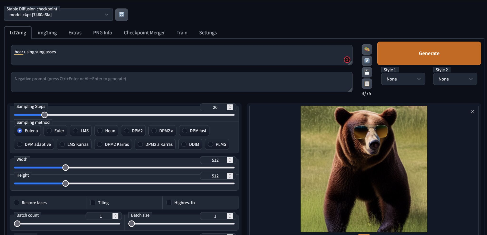
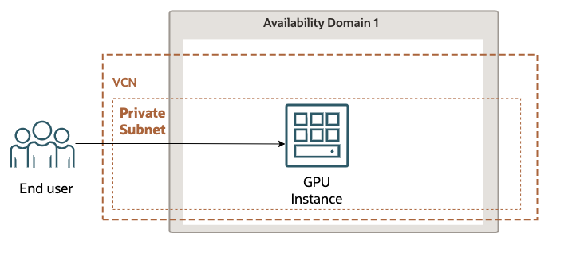

# OCI Generative AI
Terraform script to start a stable-diffusion and bloom models in compute instance using a nvidia GPU in OCI.

Stable Diffusion is a state of the art text-to-image model that generates images from text.



Bloom is a open-science, open-access multilingual large language model (LLM), with 176 billion parameters, and was trained using the NVIDIA AI platform, with text generation in 46 languages


## Architecture

The architecture consist of a GPU instance where all the dependecies and software is installed.



## Configuration

1. Follow the instructions to add the authentication to your tenant https://medium.com/@carlgira/install-oci-cli-and-configure-a-default-profile-802cc61abd4f.

2. Set two variables in your path. First the tenancy ocid and second the comparment ocid where the instance will be created.

```
export TF_VAR_tenancy_ocid='<tenancy-ocid>'
export TF_VAR_compartment_ocid='<comparment-ocid>'
```

3. Execute the script generate-keys.sh to generate private key to access the instance
```
sh generate-keys.sh
```

## Build
To build simply execute the next commands. 
```
terraform init
terraform plan
terraform apply
```

**After applying, the service will be ready in about 20 minutes** (it will install OS dependencies, nvidia drivers, clone stable-difussion-webui and download stable-diffusion-model)

If after that time the web apps are not ready, do a ssh to the machine and check that the size of the model of stable-difussion is around 4.0GB (downloading this file is the task that takes the most)

```
du -hs /home/ubuntu/stable-diffusion-webui/model.ckpt
```

## Test
To test the app it's necessary to create a ssh tunel to the port 7860 (the terraform output will give you the full command with the public IP)

```
ssh -i server.key -L 7860:localhost:7860 -L 5000:localhost:5000 ubuntu@<instance-public-ip>
```

Stable diffusion => http://localhost:7860
Bloom => http://localhost:5000

## Clean
To delete the instance execute.
```
terraform destroy
```

## Stable diffusion model
Right now the terraform is using the stable-diffusion-1.4, because I got a direct link to download the model, if you want to use 1.5 or any more recent version, you got to go to https://huggingface.co/ singup, login, download the model manually and replace the file in the location /home/ubuntu/stable-diffusion-webui/model.ckpt.

*This is the more sensible and error prone part of the process*, the stable-diffusion model. If anything happens download the model manually and reboot the instance. 

## References

- The stable-diffusion-webui project https://github.com/AUTOMATIC1111/stable-diffusion-webui
- The bloom-webui https://github.com/carlgira/bloom-webui 