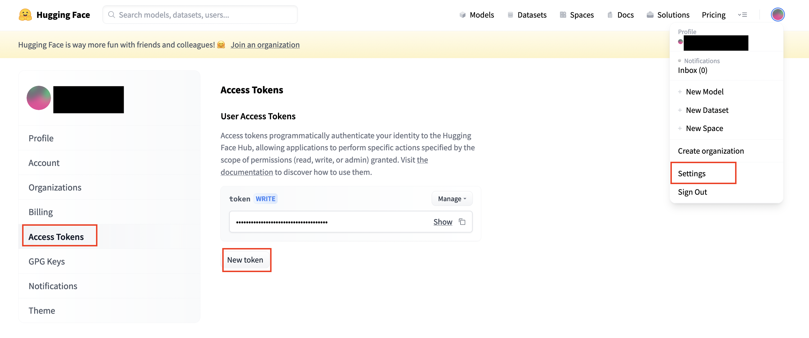

# OCI Generative AI
Terraform script to start a **stable-diffusion, bloom and dreambooth** in compute instance using a nvidia GPU in OCI.

**Stable Diffusion** is a state of the art text-to-image model that generates images from text.

**Bloom** is a open-science, open-access multilingual large language model (LLM), with 176 billion parameters, and was trained using the NVIDIA AI platform, with text generation in 46 languages

**Dreambooth** allow to fine-tune a stable diffusion model with your own data.

## Requirements

- Terraform
- ssh-keygen
- Huggingface account

## Configuration

1. Follow the instructions to add the authentication to your tenant https://medium.com/@carlgira/install-oci-cli-and-configure-a-default-profile-802cc61abd4f.

2. Clone this repository
```
# Stable diffusion 1.5
git clone --depth 1 --branch sd1.5-bloom https://github.com/carlgira/oci-generative-ai.git
```

3. Set three variables in your path. 
- The tenancy OCID, 
- The comparment OCID where the instance will be created.
- The "Region Identifier" of region of your tenancy. https://docs.oracle.com/en-us/iaas/Content/General/Concepts/regions.htm

```
export TF_VAR_tenancy_ocid='<tenancy-ocid>'
export TF_VAR_compartment_ocid='<comparment-ocid>'
export TF_VAR_region='<home-region>'
```

4. Execute the script generate-keys.sh to generate private key to access the instance
```
sh generate-keys.sh
```

## Build
To build simply execute the next commands. 
```
terraform init
terraform plan
terraform apply
```

**After applying, the service will be ready in about 25 minutes** (it will install OS dependencies, nvidia drivers, and install stable-diffusion-web-ui, bloom-web-ui and dreambooth-webui.

## Post configuration
To test the app it's necessary to create a ssh tunel to the port 7860 (stable-diffusion-webui), 5000 (bloom) and 3000 (dreambooth).  (the output of the terraform script will give the ssh full command so you only need to copy and paste)

```
ssh -i server.key -L 7860:localhost:7860 -L 5000:localhost:5000 -L 3000:localhost:3000 ubuntu@<instance-public-ip>
```

The last step of the setup is to download the stable-diffusion model, for that, is necessary to have a huggingface account, create a token and accept to the conditions to use stable-diffusion.

1. Go to https://huggingface.co and create an account.
2. Go to https://huggingface.co/runwayml/stable-diffusion-v1-5 and accept the terms and conditions.
3. Create an "Access token".
    - Open your **Profile**
    - Go to **Settings**
    - Open **Access Token** and create a token with the role **"write"**



Once the account is created, go to http://localhost:3000 (with the ssh tunnel opened) and put the credentials to download the stable diffusion model.


This is going to take 5 minutes, after that time, you are ready to go to test everything.

## Test
Make sure to have the ssh tunnel open to test the three apps.

### Bloom
Open the URL http://localhost:5000, in the text box, write wharever question come to mind, ask for a story or create a dialog.


### Stable diffusion
Open the URL http://localhost:7860, in the top text area write and idea, and stable diffusion will try to draw it on screen. 


Use https://lexica.art/ for examples of promts that you can use.

Prompts examples:


> epic battle scene humans versus zombies, post apocalyptic, humanities last stand post human, Epic Background, highly detailed, sharp focus, 8k, 35mm, cinematic lighting


> a cowboy riding a tardigrade , made by Stanley Artgerm Lau, WLOP, Rossdraws, ArtStation, CGSociety, concept art, cgsociety, octane render, trending on artstation, artstationHD, artstationHQ, unreal engine, 4k, 8k,


### Dreambooth
Open http://localhost:3000, it has several inputs, but most of them you can leave the default value and the page helps you on how to fill everything. 

Most of the time you only need two inputs: the **instance name** as a unique label to identify the thing or person you want to to train the model, and a **zip file** with the set of images you are going to use. (copy the that label somewhere because you are going to needed for later)

Make sure that your images comply with this conditions:
- All images must be 512 x 512
- Make sure you are alone in the pictures
- Have different clothing
- Different facial expressions
- Different backgrounds
- Different angles
- Only zip the images, *do not use folders*.
- 3–5 images of full body
- 5–7 images of half body
- 10–15 close images of your face


If everything is ok, you will see a countdown of the time it will take the training. That page will redirect you directly to the stable-diffusion-webui and you can start testing.

Some prompts that you can use using the unique label you pass during training could be:

> photo of &lt;your-label&gt; as a funko


> photo of &lt;your-label&gt; as a character of game of thrones


> portrait of &lt;your-label&gt; with fully armored norse valkyrie, brass plated, symmetric golden wings, divine vibes,  sky background, sharp focus, highly detailed, cinematic lighting, studio quality, smooth render, unreal engine 5 rendered, octane, rendered, by artgerm, greg rutkowski, alphonse mucha

## Clean
To delete the instance execute.
```
terraform destroy
```

## Troubleshooting
1. If one is the three apps (stable-diffusion-webui, bloom-webui, dreambooth-webui) is down, you can check the logs and the state of each service, with the commands.

```
systemctl status stabble-diffusion
systemctl status dreambooth
systemctl status bloom-webui
```

You can try to start the service by.
```
sudo systemctl start <service-name>
```

2. Once the training has started in dreambooth, you can check that is really working by running.
```
ps -ef | grep acc
```
It should appear 3 processes using the "accelerate" binary.

3. Error ***Error: 404-NotAuthorizedOrNotFound, shape VM.GPU2.1 not found***.
This could be happening because in your availability domain (AD) there is no a VM.GPU2.1 shape available. The script use by default the first AD, but maybe you have to change this manually.

Get the list of AD of your tenancy
```
oci iam availability-domain list
```

In the main.tf file, change the index number from "0" to other of the ADs of your region. (in the case that your region has more than one AD)
```
availability_domain = data.oci_identity_availability_domains.ADs.availability_domains[0].name
```
This error can also happen if in your region there is no VM.GPU2.1, in that case you have to change the region var before executing the scripts. 
```
export TF_VAR_region='<other-region>'
```

## References
- The stable-diffusion-webui project https://github.com/AUTOMATIC1111/stable-diffusion-webui
- The bloom-webui https://github.com/carlgira/bloom-webui 
- The dreambooth-webui https://github.com/carlgira/dreambooth-webui
- DotCSV explanation https://www.youtube.com/watch?v=rgKBjRLvjLs
